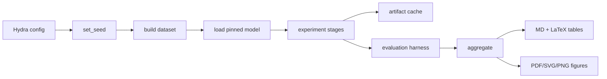

<p align="center">
  <h1 align="center">Probe-Grounded Introspection Training</h1>
  <p align="center"><strong>Use linear-probe readouts of a model's own residual stream as cheap ground truth, and train the model to verbalize them honestly.</strong></p>
  <p align="center">SPAR Fall 2026 · <a href="https://sparai.org/projects/f26/recNKpeygLfUGyGiz">Introspection Training for Verbalization Activations</a></p>
</p>

---

## Overview

This repository implements the pilot and full experimental profiles for
**Probe-Grounded Introspection Training**. The shared engineering spine (config, caching, hooks, metrics,
ablations, reporting, CI) is generated from a single template so all SPAR Fall
2026 repos stay aligned on reproducibility.

Hypothesis (one line): A model can be trained to report the state of an internal feature it was not previously verbalizing, and that ability generalizes to held-out features rather than collapsing into a surface heuristic that mimics the probe without reading the underlying activation.

Mentors: Belinda Li (Anthropic).

## Motivation

Interpretability and safety claims fail in practice for boring engineering
reasons: unpinned weights, chat templates skipped, invalid layer indices,
intervals that span zero treated as nulls, and stages that raise
`NotImplementedError`. This repo treats those as first-class bugs.

## Architecture / Pipeline



| Stage | Module | Output |
|---|---|---|
| Compose config | `configs/` + `introspect.configs` | resolved `config.yaml` |
| Build data | `introspect.data` | splits + manifest |
| Load model | `introspect.models` | `LoadedModel` + resolved commit |
| Run stages | `scripts/run_experiment.py` | per-stage JSON |
| Aggregate | `introspect.reporting` | `results.json` + tables + figures |

## Results

| Experiment | Metric | Value | Provenance |
|---|---|---:|---|
| smoke | config compose | pass | unit / CI |
| pilot | harness recovery | pending | labelled synthetic until measured |

**Provenance.** No measured number in this table comes from a full model run on
private data. Synthetic harness-validation outputs are labelled
`is_synthetic: true` and must not be reported as empirical results.

## Repository guide

```
.
├── configs/           # Hydra groups + experiment presets
├── src/introspect/       # installable library (print-free)
├── scripts/           # CLIs with argparse / hydra
├── tests/             # ≥30 modules; tiny random GPT-2 only
├── data/              # manifests only
├── docs/              # DESIGN.md, HARDWARE.md
├── TASK.md            # research plan + DAG
└── Makefile           # install, lint, test, ci, pilot, doctor
```

| Command | Purpose |
|---|---|
| `make install-dev` | editable install + pinned requirements |
| `make test` | full unit suite |
| `make ci` | lint + test + typecheck + api-contract + coverage |
| `make pilot` | end-to-end pilot profile |
| `make doctor` | environment / device report |

## Status

Shared spine is in place. Domain-specific stages land behind the experiment
registry and must pass the harness-validation script before any measured claim.

## Related work

- SPAR Fall 2026 project posting: https://sparai.org/projects/f26/recNKpeygLfUGyGiz
- Complexity bar: Critical Data PRIMED-AI / RecursiveJEPA engineering standard

## Citation

```bibtex
@misc{introspect_spar_f26,
  title        = {Probe-Grounded Introspection Training},
  author       = {Belinda Li},
  year         = {2026},
  howpublished = {SPAR Fall 2026},
  note         = {Use linear-probe readouts of a model's own residual stream as cheap ground truth, and train the model to verbalize them honestly.},
  url          = {https://sparai.org/projects/f26/recNKpeygLfUGyGiz}
}
```

## License

MIT. Model weights and third-party datasets retain their upstream licenses.

---

<p align="center">Built for reproducible interpretability pilots on Apple Silicon and CI CPUs.</p>

## Design constraints (short)

1. Library code has zero `print`, zero `argparse`, zero `__main__`.
2. Every result JSON carries `task`, `seed`, `git_sha`, `n`.
3. Model revisions are pinned; load path records the resolved commit.
4. Chat templates are applied when available; the path is recorded.
5. MPS sets `PYTORCH_ENABLE_MPS_FALLBACK` and records the flag.
6. CI spanning zero is inconclusive; report MDE and run TOST before null claims.
7. Pilot `n_items >= 512`.
8. Layer indices are validated against `n_layers`.

## Hardware note

Torch model forward passes may use MPS on Apple Silicon. Sklearn, numpy,
pandas, and matplotlib figure generation run on CPU (see `docs/HARDWARE.md`).

## Config composition

```bash
python scripts/run_config_smoke_test.py experiment=pilot model=gpt2 seed=7
python scripts/run_experiment.py experiment=baseline eval.layers=[2,4,6]
```

## Ablations

Ablations live under `src/introspect/ablation/` and return structured dicts. Presets
mirror them under `configs/experiment/ablation_*.yaml`.

## Reporting

```bash
python scripts/aggregate_results.py
python scripts/make_tables.py
python scripts/make_figures.py
```

One aggregation command regenerates Markdown and booktabs LaTeX from raw JSONs.

## Contributing

See `CONTRIBUTING.md`. Open work goes in `TASK.md` / GitHub issues — never as
`TODO` comments in library code.
